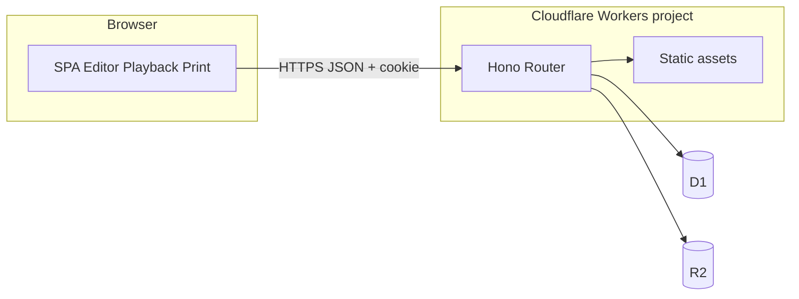
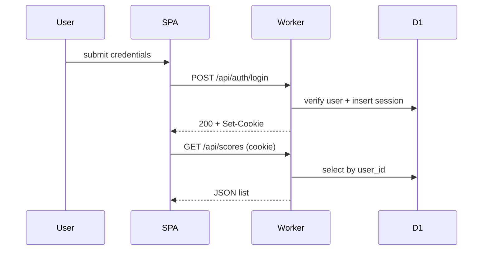
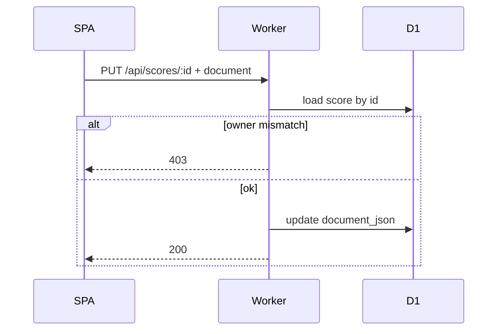

# Design: 二胡用数字譜 Web アプリ

最終更新: 2026-05-19
関連 ADR: [docs/adr/draft/erhu-numeric-notation-webapp.md](../adr/draft/erhu-numeric-notation-webapp.md)
関連 Requirements: [docs/requirements/erhu-numeric-notation-webapp.md](../requirements/erhu-numeric-notation-webapp.md)
関連 Spec: [docs/spec/erhu-numeric-notation-webapp.md](../spec/erhu-numeric-notation-webapp.md)

## 概要

React + TypeScript + Vite の SPA がブラウザで楽譜 UI・簡易再生・印刷ビューを提供する。API と静的ファイルは同一 Cloudflare Workers プロジェクト（`wrangler`）から配信し、ルーティング層は Hono を用いる。永続化は D1（ユーザー・セッション・楽譜メタ＋ JSON ドキュメント）と R2（画像バイナリ）をバインドする。



## コンポーネントと責務

| コンポーネント | 責務 | 依存 |
| --- | --- | --- |
| SPA シェル | 認証 UI、ルーティング、API クライアント | Worker `/api/*` |
| 楽譜エディタ | 数字譜モデル編集、**小節線**・**小節繰り返し**・八分／十六分／三連符、**Spec「装飾音の一覧（MVP）」「音楽記号の一覧（MVP）」各項目**、拍子表示／警告、フリーレイヤー | ローカル状態、保存時 Worker |
| 再生エンジン | Web Audio スケジューリング | 楽譜モデル |
| 印刷ビュー | `@media print` 最適化レイアウト | 楽譜モデル |
| Worker: Auth | 資格情報検証、セッション発行／失効、Argon2id | D1 |
| Worker: Scores | CRUD、所有者検査、JSON 検証（拍数ルール含む） | D1 |
| Worker: Media | 認証済みアップロード、ユーザー分離キー | R2、D1（メタ任意） |

## 公開インターフェース

認証は httpOnly Cookie にセッション ID を載せる。以下はいずれも **認証必須**（ログイン／セッション確立用の公開パスは `/api/auth/*` のみとし、その応答以外では未認証を 401 とする方針で実装する）。

```text
POST   /api/auth/login       body: { email|username, password } -> Set-Cookie: session=...
POST   /api/auth/logout      -> Clear session cookie
GET    /api/scores           -> [{ id, title, updatedAt, deleted? }]
POST   /api/scores           body: { title?, document } -> { id }
GET    /api/scores/:id       -> { id, title, document, ... }
PUT    /api/scores/:id       body: { title?, document }
DELETE /api/scores/:id       -> 論理削除
POST   /api/media            multipart: file -> { objectKey, urlForOwner }  # 匿名公開 URL は返さない
```

エラーレスポンスは JSON `{ "error": "<code>" }` を基本とし、HTTP ステータスは Spec の Unwanted 要件に従う。

## データモデル

### D1（論理）

```text
users(id PK, email unique, password_hash, created_at)
sessions(id PK, user_id FK, expires_at, created_at)
scores(id PK, user_id FK, title, document_json, deleted_at nullable, updated_at)
-- document_json: ADR の「バージョン付き楽譜ドキュメント JSON」準拠。schemaVersion を含む。
```

### R2

```text
object key pattern: u/{userId}/media/{uuid}-{filename}
-- 署名付き取得は本人操作のみ。匿名 read は設けない。
```

### 楽譜ドキュメント JSON（概念）

- `schemaVersion`: 整数。
- `parts[]`: パートごとのイベント列（数字・**八分／十六分を含む音価**・**三連符グループ**・休符・奏法タグ・**小節境界と小節線**・**小節繰り返し記号**・**装飾音（Spec「装飾音の一覧（MVP）」の各種別コード）**・**音楽記号（Spec「音楽記号の一覧（MVP）」の各種別コード）**等）。未知コードは保存可・表示はグレーアウト可（ADR）。
- `globalTranspose` / `parts[].transpose`: ADR の転調フィールド。
- `meterChanges[]`（任意）: 小節インデックスと明示拍子の対。未指定時は第1小節の拍子のみが有効起点（ADR）。
- `freeLayer[]`: テキストボックス、画像参照（R2 object 参照＋アフィン変換）、z-index。

**有効拍子の伝播**: 第1小節の明示拍子を初期値とし、`meterChanges` にある小節から新拍子を適用する。

**拍数**: 小節内の音符・休符の長さを、実装で定める単一アルゴリズム（付点・連桁・タイ、**八分・十六分**、**三連符**、**装飾音（Spec の一覧の種別ごとの拍寄与）**等の扱いをここで固定）により拍単位に合算する。SPA と Worker は同一実装（共有モジュール）を参照する。

## 反復展開規則（再生）

- 小節繰り返し記号は `parts[]` 内のイベントとして保持する。
- 再生エンジンは記号種別に応じて**反復対象となる小節範囲を決定**し、対象小節のイベントを論理順に複製した**単一タイムライン**へ展開したうえで Web Audio へスケジューリングする。
- 反復対象が解決できない配置（例: 曲先頭での不正な繰り返し）では、**該当位置をスキップ**し、UI に警告を表示する（無音でよい）。
- 印刷ビューは**繰り返し記号の可視化**を必須とし、展開譜の重ね表示の要否は UI オプションとする（ADR AC7）。

## シーケンス

### ログインと楽譜一覧



### 楽譜保存（所有者検査）



## エラーハンドリング

- 未認証 → 401（[REQ-ERHU-003](../spec/erhu-numeric-notation-webapp.md#req-erhu-003)）。
- 所有者不一致・越権 ID → 403（[REQ-ERHU-004](../spec/erhu-numeric-notation-webapp.md#req-erhu-004)）。
- バリデーション失敗（JSON スキーマ／拍数計算矛盾のサーバ拒否が必要な場合）→ 400（詳細は実装フェーズで Spec に追加する場合は ADR 変更が前提）。

## 設定 / 構成

- `wrangler.toml`（または後継形式）に D1・R2 バインディング、ルート、ビルド成果物パスを定義する（ADR: 単一プロジェクト）。

## 採用技術

- React + TypeScript + Vite、Hono、Cloudflare Workers／D1／R2、Web Audio API、Argon2id、セッション Cookie の理由・境界は [ADR](../adr/draft/erhu-numeric-notation-webapp.md) の Decision に従う。
